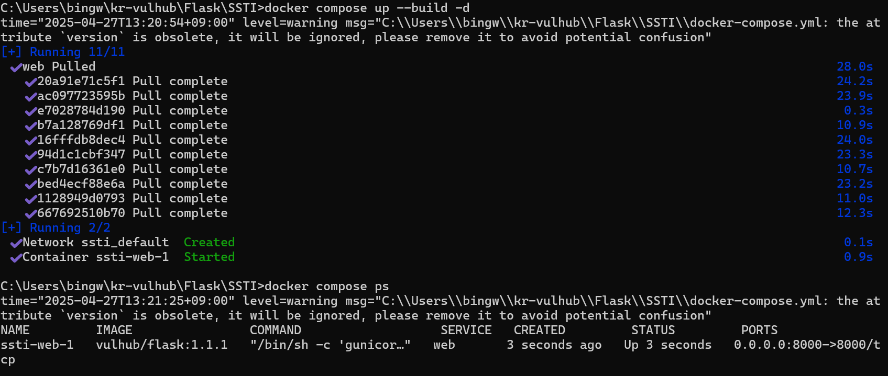
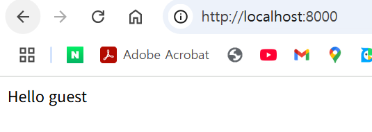
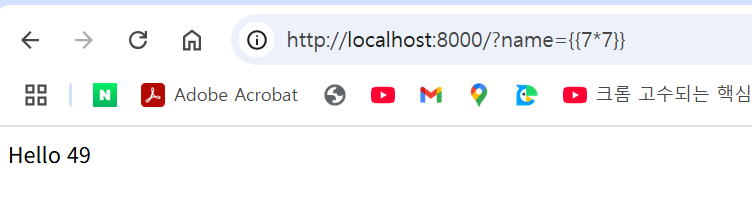
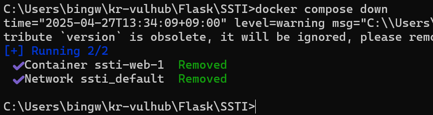

# CVE-Flask-SSTI PoC 보고서

**작성자**: 박병우 32반반  
**Fork URL**: https://github.com/byoung-woo/kr-vulhub  
**원본 레포**: https://github.com/gunh0/kr-vulhub

---

## 1. 개요
- **취약 대상**: Flask 2.x  
- **취약 유형**: Server-Side Template Injection (SSTI)  
- **요약**:  
  템플릿 엔진(Jinja2)에 사용자 입력을 그대로 전달하면, 템플릿 구문({{ ... }})이 서버에서 파이썬 코드로 평가됩니다. 그 결과 공격자는 계산식 실행(예: 7*7), 환경 변수 열람, 시스템 명령 실행까지 단계적으로 악용할 수 있습니다. 따라서 SSTI는 정보 노출에서 원격 코드 실행(RCE)로까지 확대될 수 있는 치명적 취약점입니다.


---

## 2. 환경 구성 및 PoC 

### 2.1. 로컬 환경
- **OS**: Windows 11  
- **Docker 버전**: 20.10.x  
- **Docker Compose 버전**: 1.29.x  

### 2.2. 디렉터리 구조
```bash
Flask/SSTI
├─ app.py
├─ Dockerfile
├─ docker-compose.yml
├─ README.md       ← 이 파일
└─ screenshots/
   ├─ 01_build.png      # 빌드 & 실행 로그
   ├─ 02_browser.png    # 기본 페이지
   ├─ 03_ssti.png       # PoC(7*7=49)
   └─ 04_down.png       # 종료 확인
```

### 2.3. 실행 순서
1. **PoC 환경 클론 및 디렉터리 이동**  
   ```bash
   git clone https://github.com/byoung-woo/kr-vulhub.git
   cd kr-vulhub/Flask/SSTI
   ```

2. **Docker 이미지 빌드 및 컨테이너 실행**  
   ```bash
   # Docker 2.x 이상
   docker compose up --build -d

   # 구버전
   docker-compose up --build -d
   ```

3. **컨테이너 상태 확인**  
   ```bash
   docker compose ps
   ```

4. **브라우저 접속 및 SSTI 테스트**  
   ```text
   http://localhost:8000/?name={{7*7}}
   ```

5. **컨테이너 종료**  
   ```bash
   docker compose down
   ```

### 2.4. PoC 시연 스크린샷
1. **빌드 & 시작 로그**  
   

2. **기본 페이지 로드**  
   

3. **SSTI PoC 결과 (7×7)**  
   

4. **컨테이너 종료 확인**  
   

---

## 3. GitHub 연동 & 커밋 (40%)

- **Fork URL**: https://github.com/byoung-woo/kr-vulhub  
- **주요 커밋 내역**:  
  - `2025-04-27  SSTI PoC 환경 추가 (Dockerfile, docker-compose.yml)`  
  - `2025-04-27  README.md 작성 및 스크린샷 추가`

---

## 4. 결론 및 향후 과제

- **결론**:  
  Docker만으로 Flask SSTI 취약점을 PoC 하였으며, 성공적으로 `7×7=49`를 출력함을 확인했습니다.

- **향후 개선점**:  
  - PoC 자동화 스크립트(`poc.sh`) 추가  
  - CI 환경에서 자동 빌드/테스트 설정  
  - 다른 CVE 환경(Express, Next.js 등)으로 확장

---

## 부록

- **참고문헌·링크**  
  - https://github.com/gunh0/kr-vulhub  
  - https://vulhub.org/
